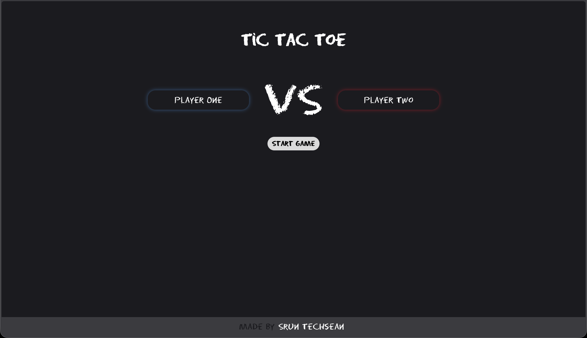
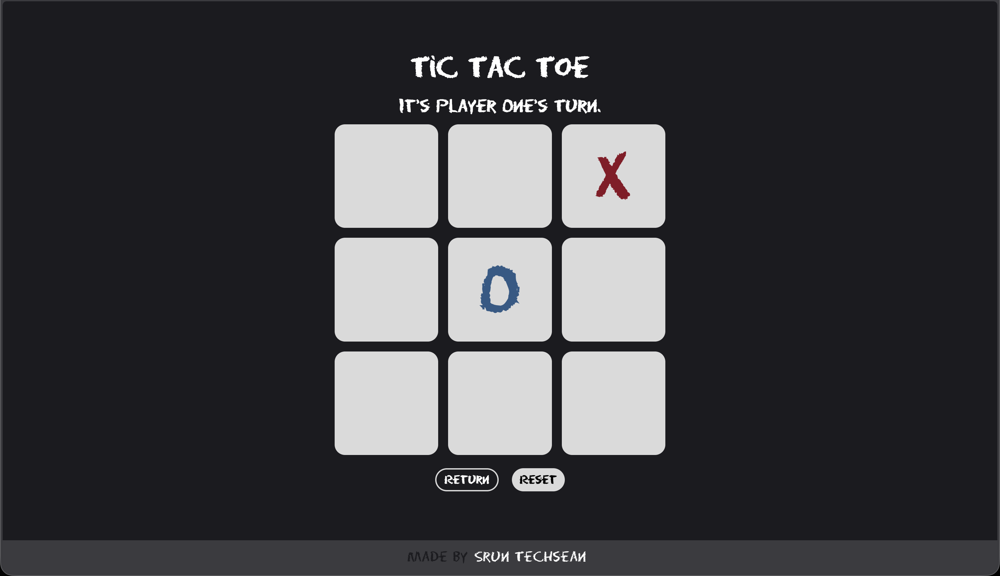

# ❌ Tic-Tac-Toe

A web-based Tic-Tac-Toe game built as part of [The Odin Project](https://www.theodinproject.com/) curriculum. This project focuses on practicing **JavaScript modules, factory functions, and the Module Pattern**.





## Table of Contents
- [Features](#features)
* [Installation](#installation)
- [Usage](#usage)
- [To-Do](#to-do)
- [Preview](#preview)
- [Acknowledgments](#acknowledgments)
- [Credits](#credits)
- [License](#license)

## Features
- **Two-Player Mode**: Two players take turns marking X and O on a 3x3 grid.
- **Win Detection**: Automatically detects when a player wins or the game ends in a draw.
- **Game Menu**: Start a new game or return to the main menu at any time.
- **Player Turn Indicator**: Clearly shows which player's turn it is.
- **Score Tracking**: Keeps track of wins for both players.
- **Clean UI**: Minimalist design with smooth transitions and responsive layout.
- **Return Button**: Easily return to the game menu without losing progress.

## Installation
1. Clone the repository:
   ```bash
   git clone https://github.com/SrunTechsean/Tic-Tac-Toe.git
   ```
2. Open `index.html` in any modern web browser.


## Usage
1. Open `index.html` in any modern web browser.
2. Click **"New Game"** from the main menu to start.
3. Players take turns clicking on the grid to place their mark (X or O).
4. The game automatically announces the winner or a draw.
5. Click **"Play Again"** to start a fresh round.
6. Use the **"Return"** button at any time to go back to the main menu.

## To-Do
- Add an AI opponent (computer vs. player).
- Implement a score history or leaderboard.
- Add sound effects for moves and wins.
- Improve accessibility with better ARIA labels.

## Preview
[Live Demo](https://sruntechsean.github.io/Tic-Tac-Toe/)

## Acknowledgments
- This project was completed as part of [The Odin Project's](https://www.theodinproject.com/) JavaScript curriculum.
- Focused on practicing **factory functions** and the **Module Pattern** in JavaScript.

## Credits
- **Font**: [Eraser](https://fonts.google.com/) — custom font added for a playful feel.
- **Icons**: Custom SVG icons for a clean interface.

## License
[MIT](https://github.com/SrunTechsean/Tic-Tac-Toe/blob/main/LICENSE) © SrunTechsean
